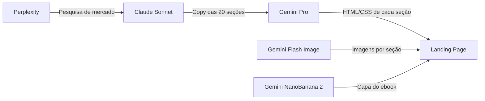

<div align="center">

# 🎨 Brugger CO — Design Toolbox

**Plataforma completa para criação de landing pages, ebooks e materiais digitais para infoprodutos bíblicos.**

[](https://react.dev)
[](https://vite.dev)
[](https://supabase.com)
[](https://ai.google.dev)
[](https://anthropic.com)

</div>

---

## 📋 Visão Geral

O **Brugger CO Design Toolbox** é uma suite de ferramentas internas para criar, gerenciar e otimizar materiais de marketing digital. Focado no nicho de **infoprodutos bíblicos**, o sistema usa múltiplas IAs (Gemini, Claude, Perplexity) para gerar desde landing pages completas até ebooks em DOCX com imagens geradas por IA.

### ✨ Principais Funcionalidades

| Ferramenta | Descrição |
|---|---|
| 🏗️ **LP Builder** | Gera landing pages completas (20 seções) com copy, imagens e design automatizados |
| 🎨 **Design Generator** | Gera seções HTML individuais com 3 variações visuais |
| 📦 **Estruturador de Produto** | Analisa LPs existentes e gera todos os entregáveis (ebooks, bônus, order bumps) em DOCX |
| 🛒 **Order Bumps Creator** | IA analisa uma LP e sugere 7 order bumps ideais com pricing e copy |
| 🎭 **Temas (Design Systems)** | Extrai design systems de sites reais via análise visual com Claude Sonnet |
| 🖼️ **Galeria** | Biblioteca de seções HTML para reutilização e inspiração |
| 📊 **Dashboard** | Visão geral de projetos, tarefas e métricas |
| 🏪 **Vitrine** | Showcase de landing pages prontas para publicação |
| 📐 **Design System Viewer** | Visualizador interativo de tokens (cores, tipografia, espaçamentos, componentes) |

---

## 🏛️ Arquitetura

```
brugger-co/
├── design-generator/          # App principal (React + Vite)
│   ├── src/
│   │   ├── pages/             # 10 páginas da aplicação
│   │   ├── services/          # 21 serviços (APIs, cache, workflows)
│   │   ├── components/        # Componentes reutilizáveis
│   │   ├── prompts/           # Templates de prompt (.md)
│   │   └── data/              # Design systems e regras de copy
│   └── scripts/               # Scripts de build e dev
│
├── design-cloner-server/      # Proxy Express para fetch de assets (CORS)
│
└── supabase/                  # Backend
    └── migrations/            # Tabelas: landing_pages, order_bumps, cache, etc.
```

### 🔗 Pipeline de IAs



| IA | Função | Modelo |
|---|---|---|
| **Perplexity** | Pesquisa de mercado e concorrência | `sonar-pro` |
| **Claude Sonnet** | Copy estratégica, análise visual de sites | `claude-sonnet-4-20250514` |
| **Gemini Pro** | Geração de HTML/CSS das seções | `gemini-2.5-pro` |
| **Gemini Flash Image** | Geração de imagens temáticas | `gemini-3.1-flash-image-preview` |
| **OpenRouter** | Roteamento multi-modelo | Múltiplos modelos |

---

## 🚀 Instalação

### Pré-requisitos

- **Node.js** 20+
- **npm** 10+
- API Keys: Gemini, Claude/OpenRouter, Perplexity, Supabase

### Setup

```bash
# 1. Clone o repositório
git clone https://github.com/CaioBrugger/app-brugger-co.git
cd app-brugger-co

# 2. Instale as dependências do proxy server
npm install

# 3. Instale as dependências do design-generator
cd design-generator
npm install

# 4. Configure as variáveis de ambiente
cp ../.env.example ../.env
# Edite ../.env com suas API keys

# 5. Inicie o servidor de desenvolvimento
npm run dev
```

### Variáveis de Ambiente (`.env`)

```env
# LLM Providers
VITE_GEMINI_API_KEY=           # Google Gemini (imagens + HTML)
VITE_OPENROUTER_API_KEY=       # OpenRouter (Claude, multi-modelo)
VITE_CLAUDE_API_KEY=           # Anthropic Claude (direto)
VITE_PERPLEXITY_API_KEY=       # Perplexity (pesquisa)

# Backend
VITE_SUPABASE_URL=             # URL do projeto Supabase
VITE_SUPABASE_ANON_KEY=        # Chave anon do Supabase
```

---

## 🔧 Funcionalidades Detalhadas

### 🏗️ LP Builder

Gera uma **landing page completa de 20 seções** a partir de uma descrição do produto:

1. **Pesquisa** — Perplexity analisa concorrência e mercado
2. **Copy** — Claude Sonnet gera copy neuro-persuasiva para 20 seções
3. **Imagens** — Gemini NanoBanana 2 gera imagens temáticas (hero = capa do ebook com selo Best Seller)
4. **UI** — Gemini Pro gera HTML/CSS responsivo estilo *"Dark Luxury Biblical"*
5. **Review** — HTML é validado e animações premium são injetadas

**Seções geradas:** Navbar, Hero, Métricas, Benefícios, Amostra, Citações Bíblicas, Desafio, Showcase, Conteúdo Completo, Para Quem É, Depoimentos, Resumo, Bônus, Pricing, Garantia, FAQ, CTA Final, Footer.

### 📦 Estruturador de Produto

Analisa uma LP existente e gera automaticamente **todos os entregáveis** do infoproduto:

- **Módulos do ebook** — Conteúdo completo em Markdown, convertido para DOCX
- **Bônus** — Materiais complementares com prompts de imagem
- **Order Bumps** — Produtos adicionais de valor
- **Imagens** — Geradas via Gemini REST API e inseridas nos DOCX

### 🎭 Temas (Design Systems)

Captura e extrai **design systems completos** de qualquer site:

1. Claude Sonnet analisa screenshots do site no browser
2. CSS e variáveis são extraídos via proxy
3. Um Design System completo é gerado (Atomic Design: atoms → molecules → organisms)
4. Preview interativo mostra todos os tokens em ação

---

## 📁 Serviços Principais

| Serviço | Responsabilidade |
|---|---|
| `landingPageBuilderService.js` | Orquestra geração completa da LP |
| `estruturadorService.js` | Análise de LP e geração de plano de produção |
| `imageGeneratorService.js` | Geração de imagens via Gemini REST API |
| `contentGeneratorService.js` | Geração de conteúdo Markdown via Claude |
| `docxExportService.js` | Conversão Markdown → DOCX com imagens |
| `productionWorkflowService.js` | Pipeline completo: prompt → conteúdo → imagens → DOCX |
| `orderBumpsService.js` | CRUD de order bumps com Supabase |
| `screenshotService.js` | Captura de screenshots via Playwright |
| `claude.js` | Client para Claude via OpenRouter |
| `perplexity.js` | Client para Perplexity Sonar |

---

## 🎨 Estética

O projeto segue a estética **"Dark Luxury Biblical"**:

- **Background:** `#0C0C0E` (near-black)
- **Accent:** `#C9A962` (golden)
- **Fontes:** DM Serif Display (títulos) + DM Sans (corpo)
- **Vibe:** Elegante, premium, espiritual — sem roxo/violeta (Purple Ban)

---

## 📄 Licença

Projeto privado. Todos os direitos reservados.

---

<div align="center">

**Brugger CO** — *Transformando infoprodutos bíblicos em experiências premium.*

</div>
